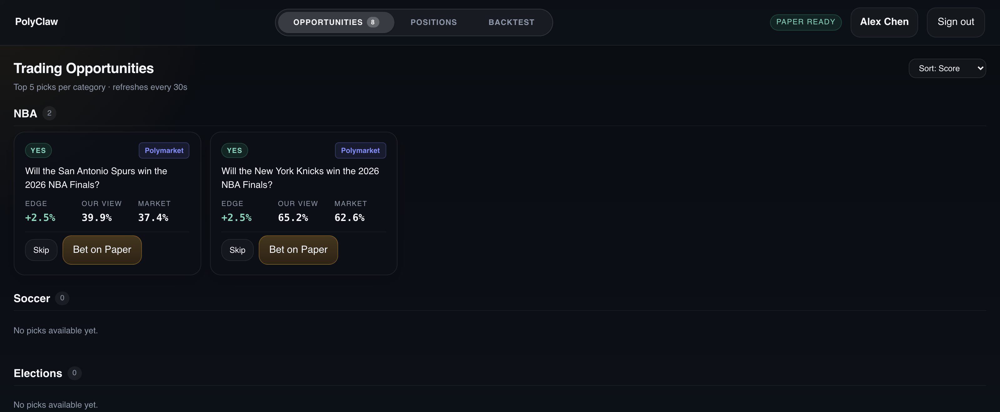
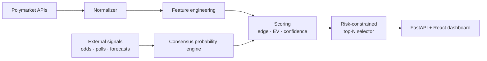

# PolyClaw

[](https://github.com/karshincheo/PolyClaw/actions/workflows/ci.yml) [](LICENSE)

**Quant bet-selection engine for Polymarket.** Ingests live markets, engineers microstructure features, blends external signals (odds, polls, forecasts) into uncertainty-aware fair probabilities, and surfaces the highest-EV bets under risk and diversification constraints — with ingestion, trading, and a React dashboard served through FastAPI.

Covers five market categories: NBA, soccer, cricket, political mentions, and elections.



*Dashboard rendering live picks from the selector pipeline (paper trading — no live keys, no positions).*

The current implementation builds a reusable pipeline to:
1. Normalize Polymarket public-market JSON payloads.
2. Engineer market microstructure features.
3. Estimate fair probability (`p_model`) from external category-relevant signals (odds/polls/forecasts) with uncertainty-aware blending.
4. Compute edge and expected value for YES/NO sides.
5. Apply risk/diversification constraints.
6. Return top 5 picks per category.

## How it works



Each selected pick is enriched with LLM-generated trade commentary (OpenAI chat completions) in the dashboard; commentary degrades gracefully when no API key is configured.

## Structure

Two subsystems share this repo:

**Selector** (`src/polyclaw/selector/` — stdlib-only, zero dependencies):

- `config.py`: framework config, category list, risk constraints.
- `models.py`: internal dataclasses.
- `polymarket_client.py`: public-API assumptions + normalization layer.
- `features.py`: feature engineering.
- `external_signals.py`: external signal ingestion + consensus probability engine.
- `scoring.py`: fair probability + EV + confidence + final scoring.
- `selection.py`: constrained top-N selector.
- `pipeline.py`: end-to-end orchestration.
- `run_selector.py` (repo root): CLI entry point — runs with no install.

**Platform** (`src/polyclaw/` — the installed package):

- `clients/`: Gamma + CLOB API clients with normalization.
- `ingestion/`: scheduled market snapshot collection.
- `storage/`: persistence layer.
- `backtest/`: backtest engine + strategy implementations.
- `trading/`: paper/live execution.
- `web/`: Flask app serving the React dashboard (`polyclaw web`).
- `cli.py`: `polyclaw` console commands — `fetch-markets`, `daemon`, `trade`, `portfolio`, `history`, `paper-reset`, `web`.

Configuration reference: every variable is documented in [.env.example](.env.example) (paper vs live mode, API endpoints, risk limits). Roadmap: [docs/POLYCLAW_V2_ROADMAP.md](docs/POLYCLAW_V2_ROADMAP.md) · Dashboard API contract: [frontend/docs/api-contract.md](frontend/docs/api-contract.md)

## Public API Assumptions

The client assumes a common documented split:
- Market metadata API (`gamma` style): `GET /markets`
- CLOB API (`execution` style): `GET /book`, `GET /trades`

Field names may differ by endpoint/version. The normalizer maps common aliases into one internal schema.

## Quick Start

Runs on the Python standard library only — no install, no API keys, works offline against the bundled sample data:

```bash
python3 run_selector.py --input data/sample_markets.json --output data/selection_output.json --pretty
```

This writes output to `data/selection_output.json` with the selected side, score, confidence, edge, EV, and rationale tags.

## Dashboard

The React dashboard source lives in `frontend/`. Pre-built assets are committed at
`src/polyclaw/web/static/app`, so Node is only needed if you change the frontend.

Install the package (provides the `polyclaw` command) and run the web server:

```bash
pip install -e .
polyclaw web --host 127.0.0.1 --port 8000
```

Then open `http://127.0.0.1:8000/` and log in with the demo credentials
`alex@polyclaw.local` / `demo1234`. The Opportunities tab shows live picks from
the selector service (it shells out to `run_selector.py --live`); the positions,
overview, and auth flows are prototype-grade with local seed data.

Rebuild the frontend only if you change `frontend/`:

```bash
cd frontend && npm install && npm run build
```

For frontend-only development:

```bash
cd frontend
npm run dev
```

### Live Polymarket Run

```bash
python3 run_selector.py --live --limit 1000 --output data/live_selection_output.json --pretty
```

This fetches live open markets from the configured public Polymarket endpoints and writes recommendations to `data/live_selection_output.json`.

Note: live fetch uses paginated `/markets` pulls and also supplements cricket with Polymarket's cricket tag feed, so IPL/other cricket markets are not missed due to broad-feed ordering.

### External Signal Driven Run

```bash
python3 run_selector.py \
  --live \
  --limit 1200 \
  --external-signals data/external_signals.sample.json \
  --output data/live_selection_output_external.json \
  --pretty
```

Use your own signal file in place of `data/external_signals.sample.json`.  
Without an external signal match for a market, the scorer falls back to heuristic fair-value.
If you want external-only picks, add `--require-external`.

External signal file shape:

```json
{
  "signals": [
    {
      "category": "NBA",
      "source": "consensus-odds",
      "market_ref": "2026-nba-champion",
      "match_terms": ["cavaliers", "nba finals"],
      "probability_yes": 0.055,
      "confidence": 0.82,
      "weight": 1.2,
      "timestamp": "2026-04-12T14:30:00Z"
    }
  ]
}
```

## Output Shape

```json
{
  "NBA": [
    {
      "market_id": "nba-1",
      "question": "...",
      "market_url": "https://polymarket.com/event/...",
      "side": "YES",
      "score": 0.73,
      "confidence": 0.78,
      "p_model_yes": 0.64,
      "p_market_yes": 0.61,
      "p_external_yes": 0.62,
      "external_confidence": 0.81,
      "external_sources": ["consensus-odds"],
      "selected_edge": 0.03,
      "expected_value": 0.03,
      "liquidity_score": 0.67,
      "spread_bps": 200.0,
      "event_group": "...",
      "rationale_tags": ["strong-edge", "positive-ev"]
    }
  ]
}
```

## Notes for Next Step (Strategy Planner)

This framework intentionally separates signal generation from execution sizing, so a later strategy planner can consume output and apply:
- stake sizing (Kelly/vol-targeted),
- inventory and risk budgets,
- execution tactics (limit laddering, slippage controls),
- portfolio-level hedging rules.
